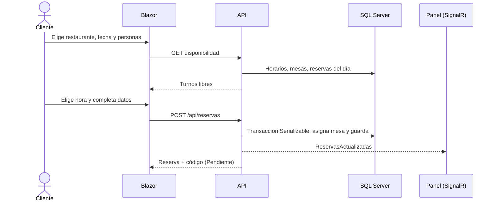
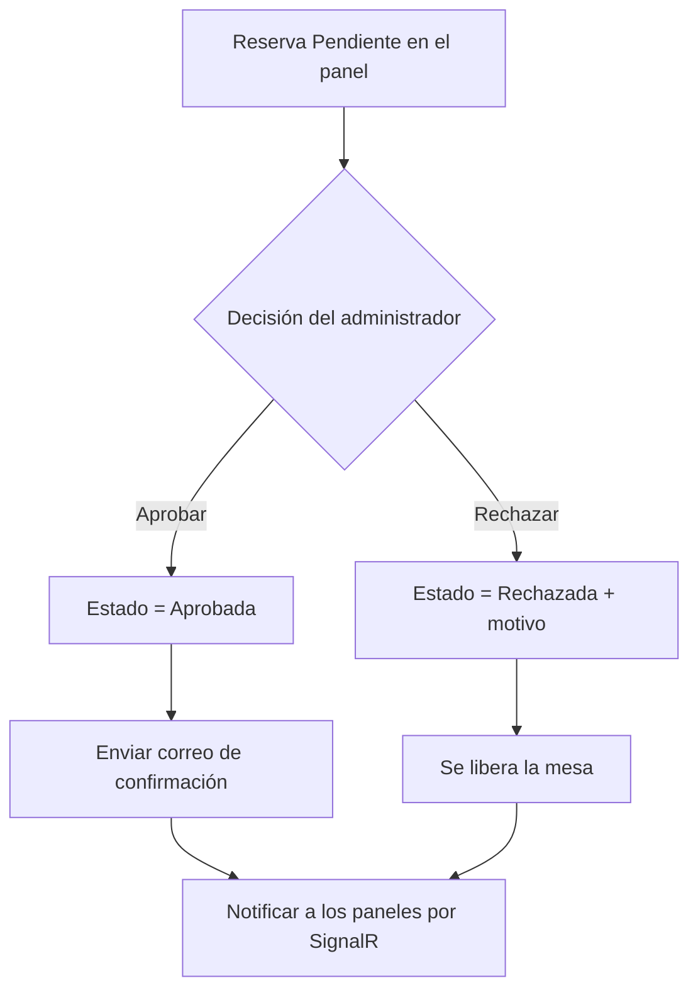
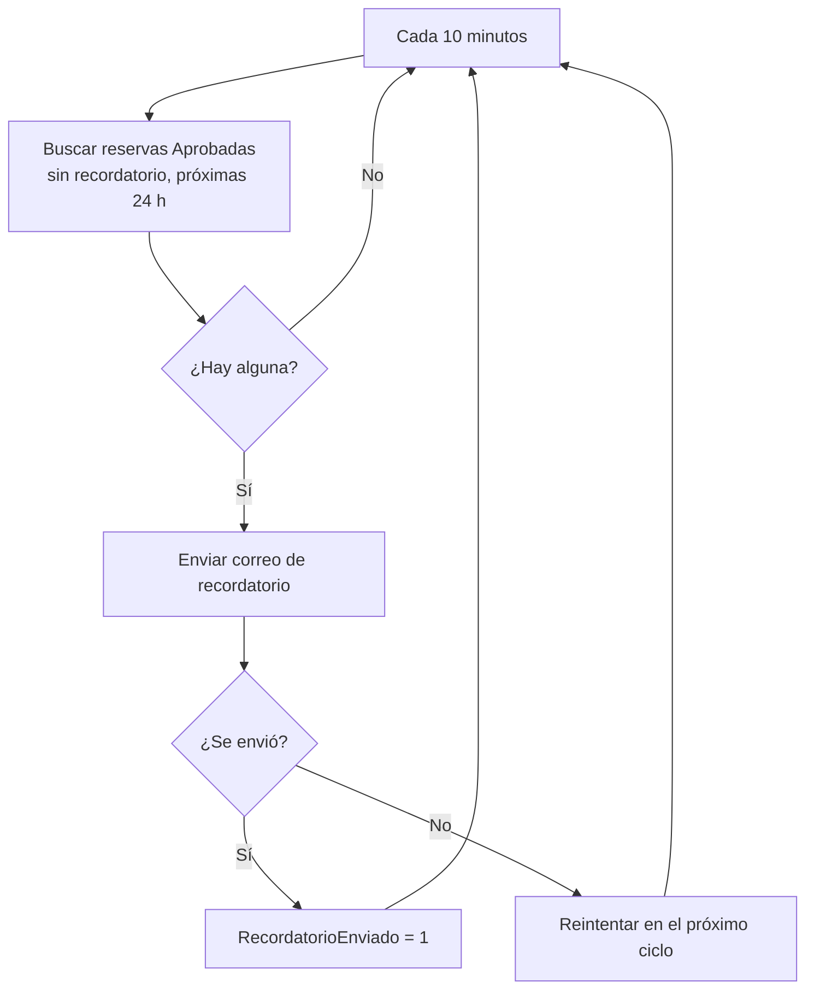
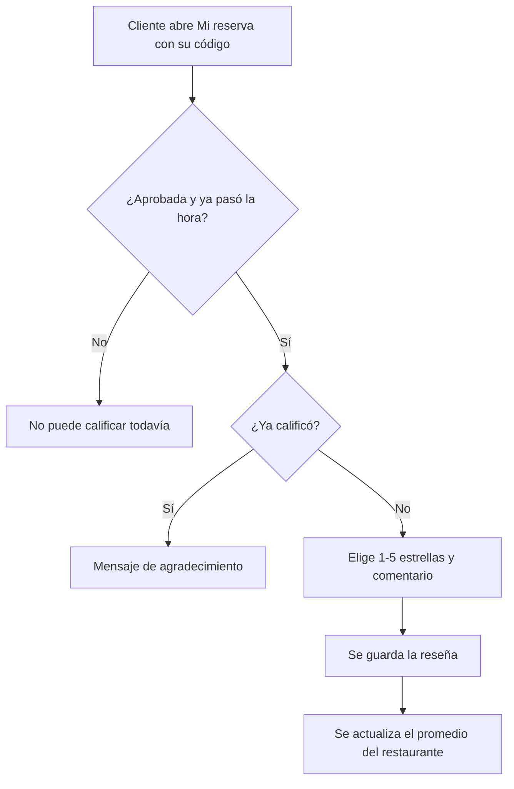
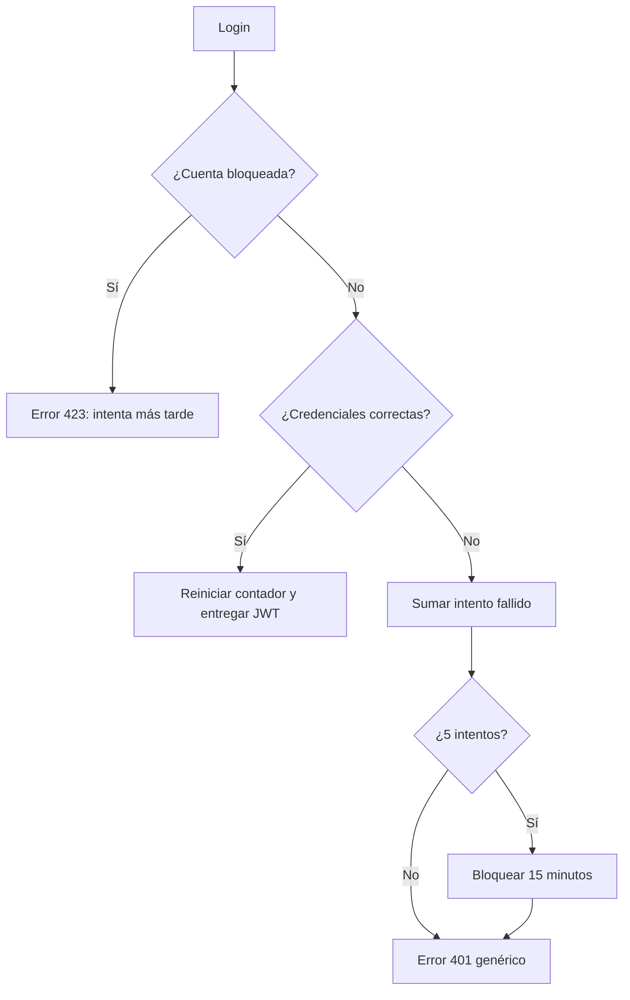

# 1. Reserva de un cliente

```mermaid
sequenceDiagram
    actor Cliente
    participant UI as Blazor
    participant API
    participant DB as SQL Server
    participant Admin as Panel (SignalR)
    Cliente->>UI: Elige restaurante, fecha y personas
    UI->>API: GET disponibilidad
    API->>DB: Horarios, mesas, reservas del día
    API-->>UI: Turnos libres
    Cliente->>UI: Elige hora y completa datos
    UI->>API: POST /api/reservas
    API->>DB: Transacción Serializable: asigna mesa y guarda
    API-->>Admin: ReservasActualizadas
    API-->>UI: Reserva + código (Pendiente)
```

# 2. Aprobación y correo de confirmación

```mermaid
flowchart TD
    A[Reserva Pendiente en el panel] --> B{Decisión del administrador}
    B -- Aprobar --> C[Estado = Aprobada]
    C --> D[Enviar correo de confirmación]
    D --> E[Notificar a los paneles por SignalR]
    B -- Rechazar --> F[Estado = Rechazada + motivo]
    F --> G[Se libera la mesa]
    G --> E
```

# 3. Recordatorio automático

```mermaid
flowchart TD
    T[Cada 10 minutos] --> Q[Buscar reservas Aprobadas<br/>sin recordatorio, próximas 24 h]
    Q --> F{¿Hay alguna?}
    F -- No --> T
    F -- Sí --> M[Enviar correo de recordatorio]
    M --> OK{¿Se envió?}
    OK -- Sí --> U[RecordatorioEnviado = 1]
    OK -- No --> R[Reintentar en el próximo ciclo]
    U --> T
    R --> T
```

# 4. Reseña posterior a la visita

```mermaid
flowchart TD
    A[Cliente abre Mi reserva con su código] --> B{¿Aprobada y ya pasó la hora?}
    B -- No --> X[No puede calificar todavía]
    B -- Sí --> C{¿Ya calificó?}
    C -- Sí --> Y[Mensaje de agradecimiento]
    C -- No --> D[Elige 1-5 estrellas y comentario]
    D --> E[Se guarda la reseña]
    E --> F[Se actualiza el promedio del restaurante]
```

# 5. Inicio de sesión con bloqueo

```mermaid
flowchart TD
    L[Login] --> B{¿Cuenta bloqueada?}
    B -- Sí --> R423[Error 423: intenta más tarde]
    B -- No --> V{¿Credenciales correctas?}
    V -- Sí --> OK[Reiniciar contador y entregar JWT]
    V -- No --> I[Sumar intento fallido]
    I --> N{¿5 intentos?}
    N -- Sí --> BL[Bloquear 15 minutos]
    N -- No --> E401[Error 401 genérico]
    BL --> E401
```
